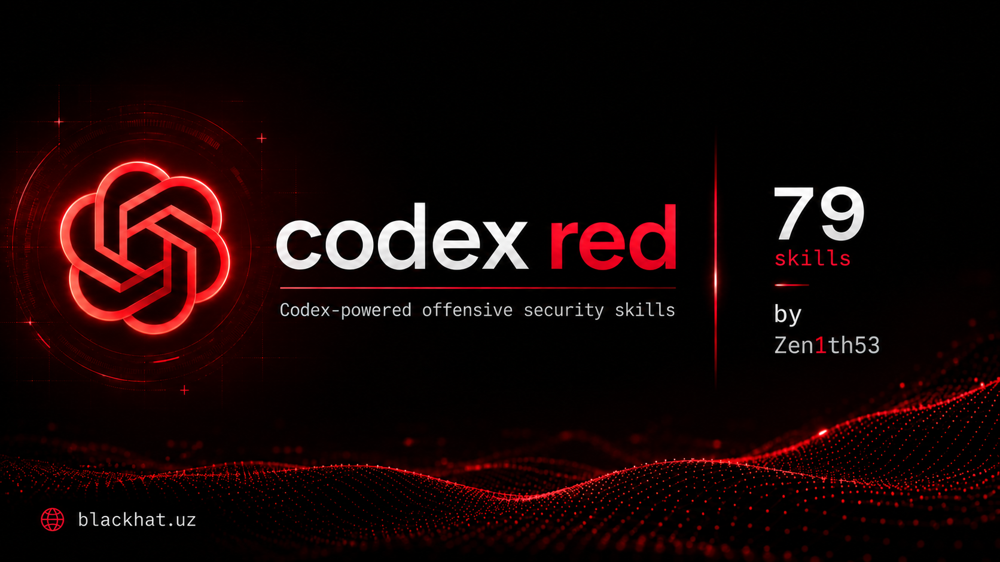

# codex-red

[](https://github.com/Zen1th53/codex-red/releases/latest)
[](https://github.com/Zen1th53/codex-red/stargazers)
[](LICENSE)

Offensive-security skills adapted for the OpenAI Codex skill system.

This repository contains 79 focused `SKILL.md` packages across web, identity, Active Directory, wireless, cloud, mobile, IoT, infrastructure, exploit development, fuzzing, reconnaissance, API security, containers, CI/CD, cryptography, privilege escalation, post-exploitation, forensics, supply chain, social engineering, networking, AI security, and reporting.

The project is derived from [SnailSploit/claude-red](https://github.com/SnailSploit/claude-red) under the MIT License. The original copyright and license are preserved in [LICENSE](LICENSE).

## Codex compatibility

Every package has Codex-compatible YAML frontmatter containing a lowercase hyphenated `name` and a discovery-oriented `description`. Legacy Claude wrappers were removed so Codex loads only the useful methodology. Skills remain separated to support progressive disclosure instead of loading the full library into context.

The installer copies each skill directly beneath the Codex skills root:

```text
~/.codex/skills/
├── offensive-osint/
│   └── SKILL.md
├── offensive-sqli/
│   └── SKILL.md
└── ...
```

## Install

```bash
git clone https://github.com/Zen1th53/codex-red.git
cd codex-red
./install.sh --dry-run
./install.sh
```

Install one category or choose another skills root:

```bash
./install.sh --category recon
./install.sh --category web
./install.sh --target /path/to/codex/skills
```

Restart Codex after installation so the new skills are discovered.

## Categories

| Category | Skills | Focus |
|---|---:|---|
| `active-directory` | 2 | AD enumeration and attack paths |
| `ai` | 1 | AI/LLM security testing |
| `api` | 2 | REST, GraphQL, gRPC, WebSocket, business logic |
| `auth` | 2 | JWT and OAuth/OIDC |
| `cicd` | 2 | Pipelines and secrets |
| `cloud` | 1 | AWS, Azure, and GCP |
| `container` | 2 | Containers and Kubernetes |
| `crypto` | 2 | Cryptographic and TLS assessment |
| `exploit-dev` | 6 | Exploit development and mitigations |
| `forensics` | 2 | Anti-forensics and C2 frameworks |
| `fuzzing` | 4 | Fuzzing and vulnerability research |
| `infrastructure` | 7 | Initial access, Windows internals, red teaming |
| `iot` | 1 | IoT, firmware, and embedded systems |
| `mobile` | 1 | Android and iOS testing |
| `network` | 1 | Network-layer attacks |
| `post-exploitation` | 3 | Lateral movement, persistence, exfiltration |
| `privesc` | 2 | Linux and Windows privilege escalation |
| `recon` | 2 | OSINT and structured reconnaissance |
| `social-engineering` | 2 | Phishing and social engineering |
| `supply-chain` | 2 | Supply-chain and dependency confusion |
| `utility` | 2 | Fast triage and reporting |
| `web` | 16 | Web vulnerability classes |
| `wireless` | 14 | Wi-Fi, Bluetooth, and RF protocols |

See [codex-skills.json](codex-skills.json) for the machine-readable index and [MINDMAP.md](MINDMAP.md) for the full taxonomy.

## Development

Rebuild the manifest after changing skills:

```bash
python3 tools/build_manifest.py
```

Normalize newly imported legacy skill documents:

```bash
python3 tools/convert_to_codex.py
```

Validate each directory with Codex's `skill-creator/scripts/quick_validate.py` before release.

## Scope

The methodologies are intended for authorized security assessment, defensive research, controlled labs, and CTF environments. Loading a skill does not grant permission to affect external systems; authorization and execution scope remain task-specific.

## Contributing

See [CONTRIBUTING.md](CONTRIBUTING.md). Keep each skill focused, preserve progressive disclosure, and validate frontmatter before submitting changes.

## License and attribution

MIT License. See [LICENSE](LICENSE). Original project: [SnailSploit/claude-red](https://github.com/SnailSploit/claude-red).

Codex adaptation maintained by Zen1th53 with OpenAI Codex.
